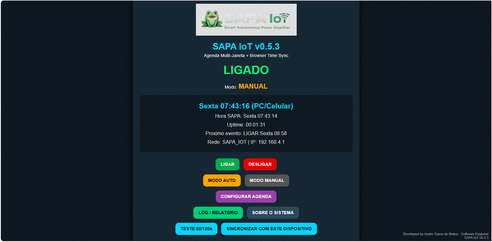
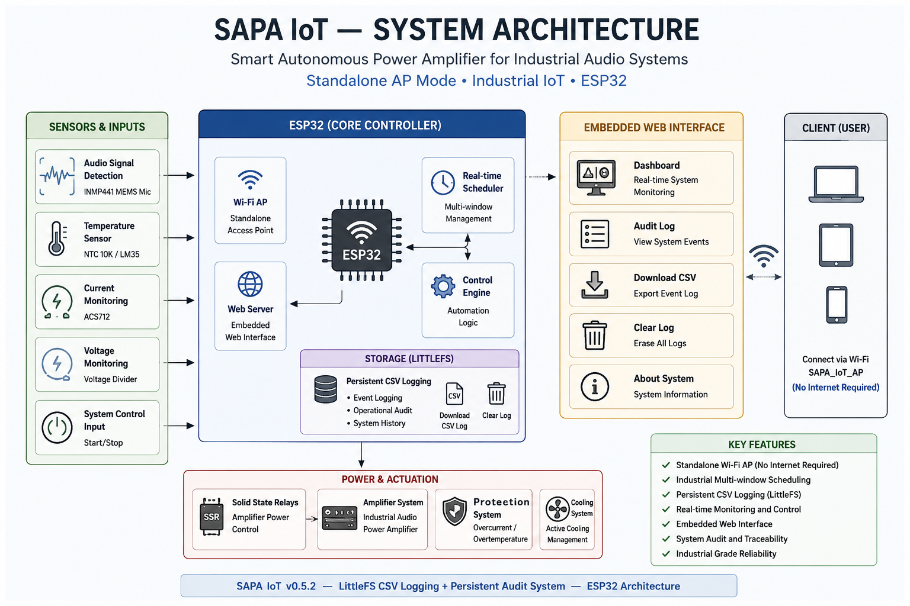
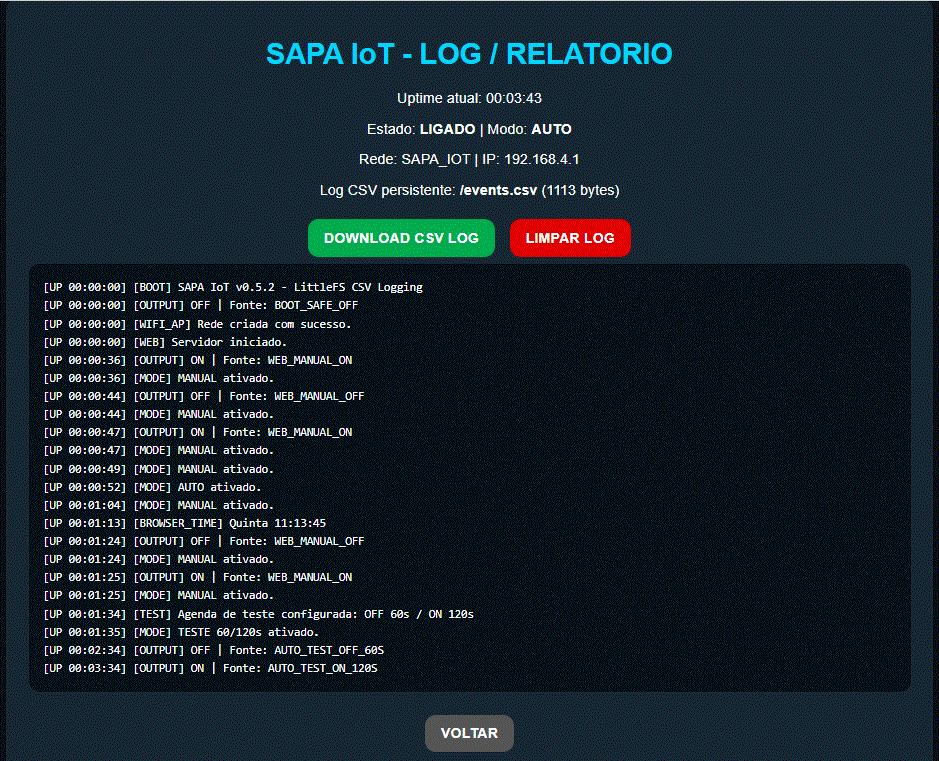
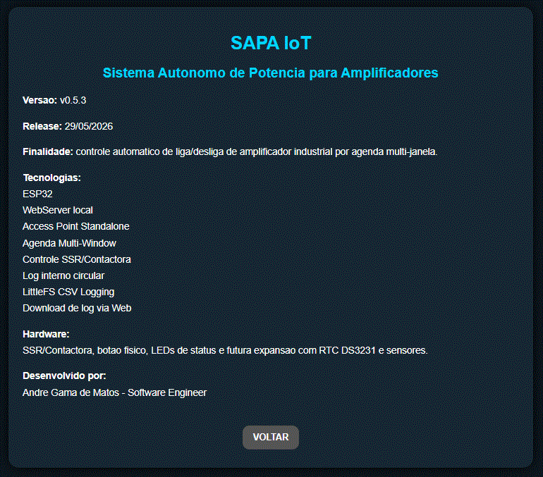

# SAPA IoT — Smart Autonomous Power Amplifier for Industrial Audio Systems

  

Embedded industrial IoT platform for autonomous power management of industrial audio amplifiers using ESP32 technology.

**Latest version:** **SAPA IoT v0.5.3 – Branding Logo + LittleFS CSV Logging**
**Release:** 29/05/2026

---

# Overview

**SAPA IoT (Smart Autonomous Power Amplifier)** is an embedded industrial automation platform developed for intelligent control and autonomous power management of industrial audio amplifiers.

The system was designed to reduce:

• Unnecessary amplifier operating time
• Thermal stress
• Power consumption
• Continuous 24/7 operation risks
• Human operational dependency

The platform uses an **ESP32 standalone architecture**, industrial scheduling logic, and a local embedded web interface for autonomous operation inside industrial environments.

The system evolved from a simple timer-based prototype into a **standalone industrial IoT platform** capable of operating independently without requiring external routers, internet access, or Windows hotspot services.

Developed by André Gama de Matos
© 2026 André Gama de Matos

---

# Main Interface

  

---

# Key Features

✔ Standalone ESP32 Access Point Mode
✔ Industrial Multi-Window Scheduling
✔ Embedded Web Configuration Interface
✔ Automatic and Manual Operating Modes
✔ SSR / Industrial Contactor Control
✔ Browser-Based Time Synchronization
✔ Embedded Persistent CSV Audit Logging
✔ Industrial Safe Boot Recovery
✔ Persistent Schedule Storage
✔ Local Network Operation without Internet
✔ Downloadable CSV Event Logs
✔ LittleFS Persistent Storage
✔ Embedded Log Management System

### Advanced Embedded Features

✔ Independent Wi-Fi network generation
✔ Real-time industrial control interface
✔ Embedded operational logging system
✔ Footer signature and release identification
✔ Modular architecture for future expansion
✔ Industrial embedded system design approach

---

# System Architecture

  

Operational pipeline:

Power ON
↓
ESP32 Boot
↓
Standalone Wi-Fi AP Creation
↓
Embedded WebServer Initialization
↓
Schedule Validation
↓
SSR / Contactor Control
↓
Industrial Audio Amplifier Power Management
↓
Event Logging + Audit Interface

The system operates using a **standalone Access Point architecture**, eliminating dependency on external routers or corporate network infrastructure.

---

# Hardware Components

ESP32 Dev Module
SSR module
Industrial contactor
Status LEDs
Push button
5V power supply
Industrial amplifier interface

### Planned Hardware Expansion

DS3231 RTC module
Temperature sensors
Industrial monitoring sensors

---

# Software Stack

ESP32
Arduino Framework
Embedded WebServer
HTML/CSS Embedded Interface
Wi-Fi AP Mode
Embedded Event Logging

---

# Multi-Window Industrial Scheduling

The SAPA IoT platform supports **multi-window industrial scheduling**.

Unlike traditional timer systems, the platform allows:

• Multiple ON/OFF intervals per day
• Weekly scheduling logic
• Independent industrial event windows
• Reduced amplifier operating time
• Improved energy efficiency

Example:

06:00 → Shift transition announcement
07:00 → ESD safety reminder
09:00 → Parking alert
13:00 → ESD reminder
14:00 → Shift transition announcement

This architecture allows the amplifier to remain powered only during operationally necessary periods.

---

# Standalone Access Point Architecture

The system creates its own Wi-Fi network:

SSID: SAPA_IOT
Password: sapa1234

Access URL:

http://192.168.4.1

This eliminates dependency on:

• External routers
• Internet access
• Corporate network infrastructure
• Windows hotspot services

The architecture improves industrial robustness and deployment simplicity.

---

# Embedded Audit Logging System

  

The platform includes an embedded operational logging system.
Logs are persistently stored using LittleFS internal storage and can be downloaded directly from the embedded web interface in CSV format.

Current events include:

• System boot
• Manual commands
• Automatic schedule actions
• Browser synchronization events
• AP initialization events
• Output state changes

Current logging capabilities include:

• Persistent CSV event storage  
• Download CSV Log button  
• Embedded log cleanup system  
• Operational audit traceability  
• Internal flash-based storage using LittleFS

Future versions will include:

• Industrial audit reports
• Power outage reports
• Operational history dashboards

---

# About System Interface

  

The system includes a dedicated "About System" page containing:

• Software version
• Release date
• Embedded technologies
• Platform architecture
• Developer information
• Industrial project identification

---

# Planned Industrial Expansion

## v0.6.0 — RTC Industrial Recovery

Planned features:

✔ DS3231 RTC integration
✔ Automatic post-blackout recovery
✔ Real-time timestamp persistence
✔ Autonomous industrial restart
✔ Automatic schedule recovery after power loss

## Future Versions

✔ CSV log export
✔ Industrial audit reports
✔ Temperature monitoring
✔ OTA firmware updates
✔ MQTT integration
✔ Dashboard integration
✔ Remote industrial monitoring

---

# Installation

Install Arduino IDE 2.3.7 or newer.

Install ESP32 board package.

Open firmware:

firmware/SAPA_IoT_v0_5_1_Audit_Log_About_STABLE.ino

Select:

Board: ESP32 Dev Module

Upload firmware to ESP32.

---

# Running the System

Power the ESP32.

Connect to Wi-Fi network:

SAPA_IOT

Password:

sapa1234

Open browser:

http://192.168.4.1

---

# Research and Industrial Context

This project contributes to research and industrial development in:

• Embedded industrial systems
• Industrial IoT
• Autonomous power management
• Industrial automation
• Smart manufacturing infrastructure
• Low-cost industrial embedded platforms

The project demonstrates the feasibility of developing industrial embedded automation systems using low-cost ESP32 technology and standalone IoT architectures.

---

# Citation

If you use this project in research or industrial applications, please cite:

Matos, A. G. (2026)
**SAPA IoT — Smart Autonomous Power Amplifier for Industrial Audio Systems**
Version 0.5.1
GitHub Repository

---

# Author

André Gama de Matos
Software Engineer — Embedded Systems and Industrial Automation

Professional Master's in Electrical Engineering
Universidade do Estado do Amazonas (UEA)

---

# License

MIT License — Open source software for research and industrial experimentation.
